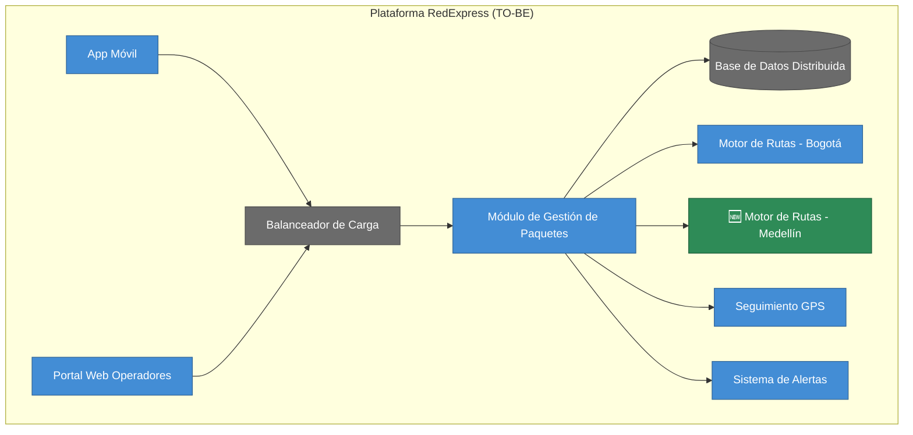
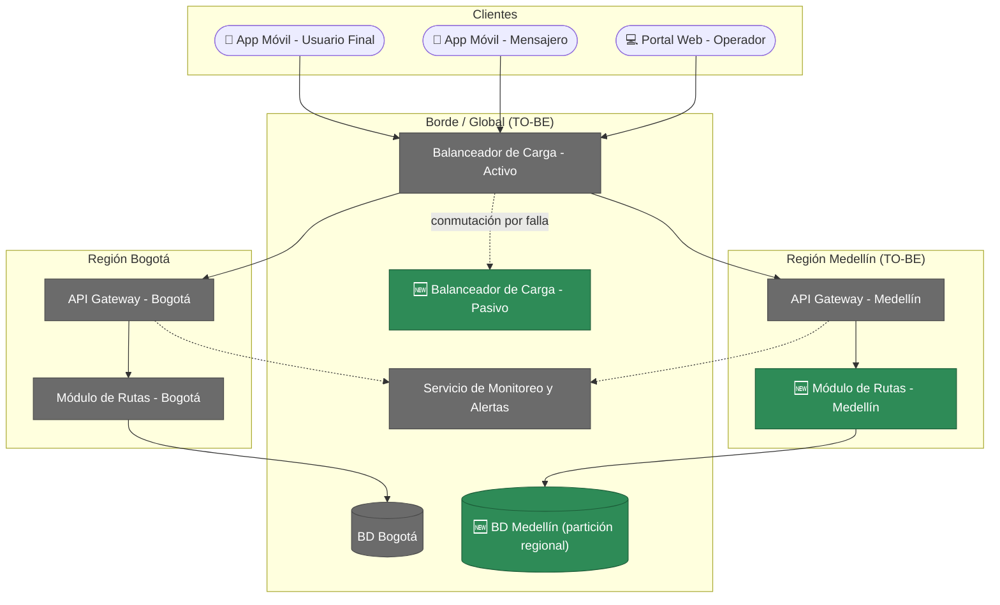
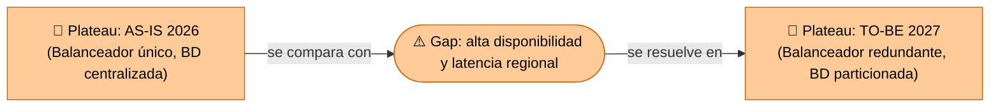

# 🧭 Guía Paso a Paso: Opportunities & Solutions (Diseño del TO-BE y Análisis de Brechas)

Esta guía complementa el `README.md` del taller y sigue la estructura oficial de la actividad de mejora de arquitectura del curso (documento `Guia_Entrega_Mejora_Arquitectura.pdf`): **Diagnóstico inicial → Propuesta de mejoras → Visualización TO-BE → Análisis de beneficios y riesgos**. Este taller no crea un caso base nuevo: retoma el **AS-IS de RedExpress** ya construido en el Taller 3 (C1/C2) y el Taller 4 (mapa de infraestructura y diagnóstico) para proponer, por primera vez en el curso, una arquitectura objetivo (TO-BE) — y hacerlo *después* de haber pasado por seguridad (Taller 5) y normatividad (Taller 6), no antes.

**Por qué este taller va aquí y no antes:** proponer un TO-BE sin haber hecho el análisis de riesgos y de cumplimiento es diseñar a ciegas. TOGAF ADM no reserva el TO-BE para el final del proyecto, pero tampoco lo dibuja sin haber consolidado los hallazgos de cada dominio — por eso Opportunities & Solutions viene después de Negocio, Datos, Aplicaciones, Infraestructura, Seguridad y Normatividad, y antes de Integración de Vistas y la presentación final.

Los diagramas de ejemplo están escritos en [Mermaid](https://mermaid.js.org/) y se renderizan automáticamente al ver este archivo en GitHub.

---

## 1. Qué es una brecha (gap) en este taller

| Tipo de brecha | Se identifica en | Ejemplo |
|---|---|---|
| Funcional / Aplicaciones | Taller 3 (C1/C2 AS-IS) | Falta un contenedor que resuelva una limitación del sistema actual |
| Técnica / Infraestructura | Taller 4 (mapa + diagnóstico) | Punto único de falla, cuello de botella, límite de escalabilidad |
| Seguridad | Taller 5 (STRIDE) | Amenaza identificada sin mitigación implementada |
| Cumplimiento | Taller 6 (checklist normativo) | Ítem marcado como "Brecha" en el checklist |

Una brecha real siempre se puede señalar en un entregable anterior. Si no puede decir de qué taller salió, probablemente no es una brecha sino una opinión.

---

## 2. Metodología en 4 partes

Esta metodología sigue exactamente la estructura de la actividad oficial de mejora de arquitectura del curso — el documento de un solo entregable (máx. 6 páginas + anexos) que el docente evalúa con la rúbrica del `README.md`:

1. **Diagnóstico inicial** — responda las tres preguntas orientadoras: ¿qué procesos o tecnologías generan mayor fricción en la operación?, ¿qué problemas recurrentes señalaron los usuarios o el cliente?, ¿qué vulnerabilidades o riesgos quedaron evidenciados en el análisis previo (brechas técnicas de los Talleres 3-4, amenazas STRIDE del Taller 5, brechas normativas del Taller 6)? El resultado esperado es un resumen breve — una "foto" del problema actual — que sirve de base para proponer mejoras.
2. **Propuesta de mejoras** — abra el espectro sin censura inicial: haga primero una lluvia de ideas de al menos 6 mejoras (procesos, comunicación con el cliente, tecnología, seguridad — no solo infraestructura), y luego priorice 2-3 con justificación, distinguiendo quick wins de mejoras de mayor impacto o largo plazo.
3. **Visualización TO-BE** — represente cómo se transforma el proceso actual en uno más ágil o seguro (BPMN o diagrama simple) y qué cambios de aplicaciones, infraestructura y flujos de información se introducen (C4/ArchiMate), señalando explícitamente qué controles de seguridad del Taller 5 se integran.
4. **Análisis de beneficios y riesgos** — construya una matriz de brechas cerradas y beneficios esperados, y contrástela con una tabla de riesgos, limitaciones o dependencias que podrían impedir la implementación.

---

## 3. Ejemplo guiado: TO-BE de RedExpress

### Parte 1 — Diagnóstico inicial

Se responde primero a las tres preguntas orientadoras, apoyándose en lo ya diagnosticado en el AS-IS de RedExpress:

| Pregunta orientadora | Respuesta para RedExpress | Taller de origen |
|---|---|---|
| ¿Qué procesos o tecnologías generan mayor fricción en la operación? | El balanceador de carga único y la base de datos con escritura centralizada en Bogotá generan lentitud y riesgo de caída total ante picos de demanda (ej. campañas de fin de año). | Taller 4 |
| ¿Qué problemas recurrentes señalan los usuarios o el cliente? | Los usuarios de Medellín reportan demoras en la asignación de rutas porque toda solicitud depende del motor de rutas de Bogotá. | Taller 4 |
| ¿Qué vulnerabilidades de seguridad o riesgos quedaron evidenciados en el análisis previo? | Punto único de falla en el balanceador, cuello de botella de escritura en la BD, límite de escalabilidad geográfica en Medellín. | Taller 4 |

Esto se traduce en la misma lista de riesgos/brechas ya diagnosticados en la guía de infraestructura del Taller 4:

| Riesgo / Brecha | Taller de origen | Tipo |
|---|---|---|
| Balanceador de Carga (instancia única) | Taller 4 | Técnica |
| Base de Datos Distribuida (escritura única en Bogotá) | Taller 4 | Técnica |
| Región Medellín sin módulo de rutas propio | Taller 4 | Técnica / Funcional |

> **En su proyecto con el cliente real**, responda las tres preguntas orientadoras sumando también las brechas de seguridad (Taller 5) y de cumplimiento normativo (Taller 6) — el ejercicio de clase se enfoca solo en las brechas técnicas de RedExpress porque son las que ya están completamente diagnosticadas en el curso.

### Parte 2 — Propuesta de mejoras (lluvia de ideas y priorización)

**Lluvia de ideas (sin censura inicial):** antes de elegir qué construir, el equipo genera una lista amplia de posibles mejoras para RedExpress sin descartar ninguna todavía. Algunas son cambios técnicos; otras son ajustes de proceso o de comunicación con el cliente que ni siquiera requieren tocar la infraestructura:

| # | Idea de mejora | Tipo |
|---|---|---|
| 1 | Balanceador de carga redundante (activo-pasivo) | Técnica |
| 2 | Base de datos particionada por región | Técnica |
| 3 | Módulo de rutas propio en Medellín | Técnica / Funcional |
| 4 | Notificaciones proactivas al cliente cuando se detecta una demora prevista en la entrega | Proceso / Comunicación |
| 5 | Checklist digital de verificación del paquete en el punto de entrega, firmado por el mensajero | Proceso |
| 6 | Encuesta corta de satisfacción integrada en la app, justo después de cada entrega | Proceso / Comunicación |
| 7 | Canal de WhatsApp o chatbot para consultar el estado de un envío sin llamar a soporte | Proceso / Comunicación |
| 8 | Panel unificado de monitoreo para operadores, con alertas por región | Técnica (mediano plazo) |

**Priorización (2-3 ideas seleccionadas, con justificación):** de las 8 ideas anteriores, el equipo prioriza las 3 mejoras técnicas porque son las únicas con una brecha ya diagnosticada y evidenciada en el Taller 4 (trazabilidad directa AS-IS → TO-BE). Las ideas de proceso (4-7) son válidas y de bajo esfuerzo (quick wins), pero quedan como backlog para una siguiente iteración porque todavía no tienen un hallazgo formal que las respalde en este curso.

> **En su cliente real**, si una idea de proceso responde a un problema recurrente detectado en entrevistas (pregunta orientadora 2 del Diagnóstico), sí debe priorizarla aquí con la misma justificación — no descarte una mejora solo por ser "de proceso" en vez de técnica.

| Solución priorizada | Esfuerzo | Impacto | Quick win / Largo plazo | Prioridad |
|---|---|---|---|---|
| Balanceador redundante | Medio | Alto | Quick win | 1 |
| BD particionada por región | Alto | Alto | Largo plazo | 2 |
| Módulo de rutas en Medellín | Alto | Medio | Largo plazo | 3 |

### Parte 3 — Visualización TO-BE

**TO-BE de Aplicaciones:** se extiende el C2 del Taller 3 agregando un **Módulo de Procesamiento de Rutas y Paquetes - Medellín**, réplica del de Bogotá, para que la región deje de depender de un solo punto de procesamiento.

**TO-BE de Tecnología:** se extiende el mapa del Taller 4: el balanceador pasa a ser redundante (activo-pasivo) y la base de datos se particiona por región para reducir la dependencia de una única escritura centralizada en Bogotá.

**Controles de seguridad integrados:** el ejemplo guiado de RedExpress de este curso no tiene un Taller 5 construido específicamente para este caso (el ejemplo guiado de STRIDE del Taller 5 usa un sistema académico distinto, no RedExpress). *En su cliente real, incluya aquí los controles de seguridad del Taller 5 que apliquen a este TO-BE* — por ejemplo, si alguna de sus mitigaciones STRIDE (rate limiting, cifrado en tránsito/reposo, RBAC, auditoría) protege directamente uno de los componentes que este TO-BE modifica, decláralo explícitamente y trace la relación, tal como lo pide el documento oficial de la actividad.

### Parte 4 — Análisis de beneficios y riesgos

**Brechas cerradas y beneficios esperados:**

| AS-IS | TO-BE | Brecha que cierra | Beneficio esperado |
|---|---|---|---|
| Balanceador único | Balanceador redundante (activo-pasivo) | Punto único de falla | Alta disponibilidad de toda la plataforma |
| BD con escritura única en Bogotá | BD particionada por región | Cuello de botella de latencia | Mejor rendimiento del rastreo en tiempo real fuera de Bogotá |
| Medellín sin módulo de rutas propio | Módulo de rutas replicado en Medellín | Límite de escalabilidad geográfica | La región puede crecer sin saturar Bogotá |

**Riesgos, limitaciones y dependencias de implementación:** ninguna mejora es gratis. Antes de dar por buena la priorización, el equipo contrasta cada solución con lo que podría impedir o retrasar su implementación:

| Solución | Riesgo / limitación / dependencia |
|---|---|
| Balanceador redundante | Depende de la aprobación de presupuesto adicional del proveedor cloud para la segunda instancia; si no se aprueba, la mejora no puede iniciar en el plazo previsto. |
| BD particionada por región | Requiere una migración con ventana de mantenimiento; existe riesgo de downtime parcial y de inconsistencia de datos durante la sincronización inicial entre particiones. |
| Módulo de rutas en Medellín | Depende de contratar o reasignar personal técnico en la región; sin ese equipo local, el módulo replicado no tiene quién lo opere ni lo mantenga. |

> Esta tabla priorizada (esfuerzo, impacto y ahora riesgos) es exactamente el insumo del **Plan de Implementación** del Taller 9 — no se vuelve a analizar desde cero, solo se traduce a fases con esfuerzo, duración, responsable y mitigación de riesgo.

---

## 4. Errores comunes a evitar

| Error frecuente | Por qué es un problema | Cómo corregirlo |
|---|---|---|
| Proponer el TO-BE sin partir de brechas concretas del AS-IS | El diseño se vuelve una lista de deseos, no una solución a un problema diagnosticado | Cada elemento del TO-BE debe corregir una brecha específica listada en la Parte 1 (Diagnóstico) |
| Ignorar las brechas de seguridad y cumplimiento (Talleres 5 y 6) | El TO-BE queda técnicamente atractivo pero inseguro o ilegal | Incluya siempre brechas de STRIDE y Normatividad en el diagnóstico, no solo técnicas |
| Saltar directo a la solución sin lluvia de ideas previa | Se pierden mejoras de proceso o quick-win que no requieren tocar infraestructura, y la priorización final parece arbitraria | Genere primero al menos 6 ideas sin censura (Parte 2) y solo después reduzca a 2-3 con justificación |
| Priorizar solo por impacto, sin considerar esfuerzo | Se proponen soluciones inviables en el tiempo del proyecto | Cruce impacto y esfuerzo al priorizar, distinguiendo quick wins de mejoras de largo plazo (Parte 2) |
| TO-BE que no se puede rastrear al AS-IS original | El comité no puede evaluar si la solución realmente resuelve el problema | Use el mismo nombre de los componentes del AS-IS al proponer el cambio (Parte 3) |
| Documentar solo beneficios y omitir los riesgos de implementación | El comité aprueba una solución sin conocer sus dependencias reales (presupuesto, ventanas de mantenimiento, personal) y estas se descubren tarde | Incluya siempre una tabla de riesgos/limitaciones frente a los beneficios (Parte 4) |

---

## 5. Checklist de autoevaluación antes de entregar

- [ ] Se respondieron explícitamente las tres preguntas orientadoras del diagnóstico (fricción, problemas recurrentes, vulnerabilidades/riesgos previos).
- [ ] Se consolidaron las brechas de los Talleres 3, 4, 5 y 6 (no solo las técnicas).
- [ ] Se hizo una lluvia de ideas de al menos 6 mejoras antes de priorizar 2-3.
- [ ] El TO-BE de Aplicaciones extiende explícitamente el C2 del Taller 3, no lo reemplaza desde cero.
- [ ] El TO-BE de Tecnología extiende explícitamente el mapa del Taller 4, no lo reemplaza desde cero.
- [ ] Se señaló explícitamente qué control de seguridad del Taller 5 se integra en el TO-BE.
- [ ] Cada elemento del TO-BE está trazado a una brecha específica del AS-IS.
- [ ] Las soluciones están priorizadas por impacto y esfuerzo, distinguiendo quick wins de mejoras de largo plazo.
- [ ] El análisis incluye riesgos/limitaciones que podrían impedir la implementación, no solo beneficios.
- [ ] La matriz de brechas queda lista para alimentar el Plan de Implementación del Taller 9.

---

## 6. Vista ArchiMate equivalente

Este es el taller donde ArchiMate deja de ser "una notación más" y se vuelve la herramienta correcta para el trabajo: la capa de **Implementación y Migración** (ver la [Guía de Notación ArchiMate](https://github.com/CesarAVegaF312/AREM-ArchiMate/blob/main/guia_notacion_archimate.md)) tiene elementos diseñados exactamente para un análisis de brechas — **Plateau** (un estado estable de la arquitectura) y **Gap** (la diferencia entre dos plateaus).

La matriz de brechas de la Parte 4 (Análisis de beneficios y riesgos) **es**, en el fondo, una lista de elementos `Gap`: cada fila conecta un `Plateau` AS-IS (lo diagnosticado en los Talleres 3-6) con un `Plateau` TO-BE (lo que este taller propone). Esos mismos `Gap` son los que el Taller 9 convierte en `Work Package` dentro del Plan de Implementación — la cadena completa en ArchiMate es: **Constraint/Requirement (Talleres 5-6) → Gap (este taller) → Work Package (Taller 9) → nuevo Plateau**.

---

_Esta guía hace parte del Taller 7 de Opportunities & Solutions — curso Arquitectura Empresarial, Universidad de La Sabana._
