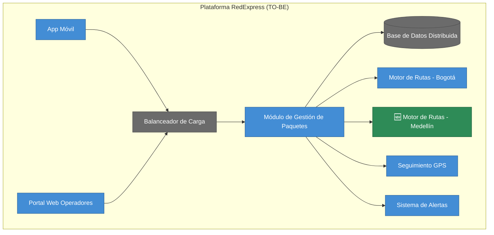

# 🧭 Guía Paso a Paso: Opportunities & Solutions (Diseño del TO-BE y Análisis de Brechas)

Esta guía complementa el `README.md` del taller. Este taller no crea un caso base nuevo: retoma el **AS-IS de RedExpress** ya construido en el Taller 3 (C1/C2) y el Taller 4 (mapa de infraestructura y diagnóstico) para proponer, por primera vez en el curso, una arquitectura objetivo (TO-BE) — y hacerlo *después* de haber pasado por seguridad (Taller 5) y normatividad (Taller 6), no antes.

**Por qué este taller va aquí y no antes:** proponer un TO-BE sin haber hecho el análisis de riesgos y de cumplimiento es diseñar a ciegas. TOGAF ADM no reserva el TO-BE para el final del proyecto, pero tampoco lo dibuja sin haber consolidado los hallazgos de cada dominio — por eso Opportunities & Solutions viene después de Negocio, Datos, Aplicaciones, Infraestructura, Seguridad y Normatividad, y antes de Integración de Vistas y la presentación final.

Los diagramas de ejemplo están escritos en [Mermaid](https://mermaid.js.org/) y se renderizan automáticamente al ver este archivo en GitHub.

---

## 1. Qué es una brecha (gap) en este taller

| Tipo de brecha | Se identifica en | Ejemplo |
|---|---|---|
| Funcional / Aplicaciones | Taller 3 (C1/C2 AS-IS) | Falta un contenedor que resuelva una limitación del sistema actual |
| Técnica / Infraestructura | Taller 4 (mapa + diagnóstico) | Punto único de falla, cuello de botella, límite de escalabilidad |
| Seguridad | Taller 5 (STRIDE) | Amenaza identificada sin mitigación implementada |
| Cumplimiento | Taller 6 (checklist normativo) | Ítem marcado como "Brecha" en el checklist |

Una brecha real siempre se puede señalar en un entregable anterior. Si no puede decir de qué taller salió, probablemente no es una brecha sino una opinión.

---

## 2. Metodología en 5 pasos

1. **Consolidar los hallazgos del AS-IS** — reúna en una sola lista las brechas ya diagnosticadas en los Talleres 3, 4, 5 y 6 (no solo las técnicas).
2. **Definir el TO-BE de Aplicaciones** — para las brechas funcionales/técnicas de aplicaciones, proponga el cambio directamente sobre el C2 del Taller 3.
3. **Definir el TO-BE de Tecnología** — para las brechas de infraestructura, proponga el cambio directamente sobre el mapa del Taller 4.
4. **Construir la matriz de brechas (Gap Analysis)** — enfrente cada elemento AS-IS con su propuesta TO-BE y el beneficio esperado de cerrar esa brecha.
5. **Priorizar las soluciones** — clasifique cada solución por esfuerzo e impacto; esta priorización es el insumo directo del Plan de Implementación del Taller 9.

---

## 3. Ejemplo guiado: TO-BE de RedExpress

### Paso 1 — Consolidar los hallazgos del AS-IS

Se reutilizan los 3 riesgos ya diagnosticados en la guía de infraestructura del Taller 4 para RedExpress:

| Riesgo / Brecha | Taller de origen | Tipo |
|---|---|---|
| Balanceador de Carga (instancia única) | Taller 4 | Técnica |
| Base de Datos Distribuida (escritura única en Bogotá) | Taller 4 | Técnica |
| Región Medellín sin módulo de rutas propio | Taller 4 | Técnica / Funcional |

> **En su proyecto con el cliente real**, sume aquí también las brechas de seguridad (Taller 5) y de cumplimiento normativo (Taller 6) — el ejercicio de clase se enfoca solo en las brechas técnicas de RedExpress porque son las que ya están completamente diagnosticadas en el curso.

### Paso 2 — Definir el TO-BE de Aplicaciones

Se extiende el C2 del Taller 3 agregando un **Módulo de Procesamiento de Rutas y Paquetes - Medellín**, réplica del de Bogotá, para que la región deje de depender de un solo punto de procesamiento.

### Paso 3 — Definir el TO-BE de Tecnología

Se extiende el mapa del Taller 4: el balanceador pasa a ser redundante (activo-pasivo) y la base de datos se particiona por región para reducir la dependencia de una única escritura centralizada en Bogotá.

### Paso 4 — Construir la matriz de brechas (Gap Analysis)

| AS-IS | TO-BE | Brecha que cierra | Beneficio esperado |
|---|---|---|---|
| Balanceador único | Balanceador redundante (activo-pasivo) | Punto único de falla | Alta disponibilidad de toda la plataforma |
| BD con escritura única en Bogotá | BD particionada por región | Cuello de botella de latencia | Mejor rendimiento del rastreo en tiempo real fuera de Bogotá |
| Medellín sin módulo de rutas propio | Módulo de rutas replicado en Medellín | Límite de escalabilidad geográfica | La región puede crecer sin saturar Bogotá |

### Paso 5 — Priorizar las soluciones

| Solución | Esfuerzo | Impacto | Prioridad |
|---|---|---|---|
| Balanceador redundante | Medio | Alto | 1 |
| BD particionada por región | Alto | Alto | 2 |
| Módulo de rutas en Medellín | Alto | Medio | 3 |

> Esta tabla priorizada es exactamente el insumo del **Plan de Implementación** del Taller 9 — no se vuelve a analizar desde cero, solo se traduce a fases con esfuerzo, duración y responsable.

---

## 4. Errores comunes a evitar

| Error frecuente | Por qué es un problema | Cómo corregirlo |
|---|---|---|
| Proponer el TO-BE sin partir de brechas concretas del AS-IS | El diseño se vuelve una lista de deseos, no una solución a un problema diagnosticado | Cada elemento del TO-BE debe corregir una brecha específica listada en el Paso 1 |
| Ignorar las brechas de seguridad y cumplimiento (Talleres 5 y 6) | El TO-BE queda técnicamente atractivo pero inseguro o ilegal | Incluya siempre brechas de STRIDE y Normatividad en la matriz, no solo técnicas |
| Priorizar solo por impacto, sin considerar esfuerzo | Se proponen soluciones inviables en el tiempo del proyecto | Cruce impacto y esfuerzo al priorizar (Paso 5) |
| TO-BE que no se puede rastrear al AS-IS original | El comité no puede evaluar si la solución realmente resuelve el problema | Use el mismo nombre de los componentes del AS-IS al proponer el cambio |

---

## 5. Checklist de autoevaluación antes de entregar

- [ ] Se consolidaron las brechas de los Talleres 3, 4, 5 y 6 (no solo las técnicas).
- [ ] El TO-BE de Aplicaciones extiende explícitamente el C2 del Taller 3, no lo reemplaza desde cero.
- [ ] El TO-BE de Tecnología extiende explícitamente el mapa del Taller 4, no lo reemplaza desde cero.
- [ ] Cada elemento del TO-BE está trazado a una brecha específica del AS-IS.
- [ ] Las soluciones están priorizadas por impacto y esfuerzo, no solo por impacto.
- [ ] La matriz de brechas queda lista para alimentar el Plan de Implementación del Taller 9.

---

_Esta guía hace parte del Taller 7 de Opportunities & Solutions — curso Arquitectura Empresarial, Universidad de La Sabana._
